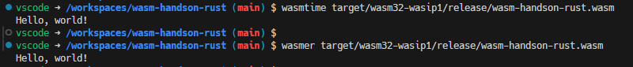

## rustとして実行する
```
cargo run
```

## wasmとしてビルドする

```sh
rustup target add wasm32-wasip1
cargo build --target wasm32-wasi --release
```


targetには`wasm32-wasi`ではなく`wasm32-wasip1`が推奨されるようになった模様。


```sh
rustup target add wasm32-wasip1
cargo build --target wasm32-wasip1 --release
```

以下のように`target/wasm32-wasip1/release/wasm-handson-rust.wasm`が生成された。


`cargo new`しただけのhello-worldなコードのwasmファイルは63KBだった。


## wasmとして実行する

```sh
wasmer target/wasm32-wasip1/release/wasm-handson-rust.wasm
```

```sh
wasmtime target/wasm32-wasip1/release/wasm-handson-rust.wasm
```



## webAPI化する

```sh
cargo add actix-web
```

```rust
use actix_web::{get, App, HttpServer, Responder};

#[get("/")]
async fn hello() -> impl Responder {
    "Hello, world!"
}

#[actix_web::main]
async fn main() -> std::io::Result<()> {
    HttpServer::new(|| App::new().service(hello))
        .bind("127.0.0.1:8080")?
        .run()
        .await
}
```

## wasm化せずにrustとしてwebAPIを実行する

```sh
cargo run
```

ブラウザで`localhost:8080`を開く


## webAPI化したrustコードからwasmを生成する

```sh
cargo build --target wasm32-wasip1 --release
```

以下のエラーが出てwasmを生成できなかった

<details>
<summary>ビルド時のエラーログ</summary>

```
error[E0308]: mismatched types
    --> /usr/local/cargo/registry/src/index.crates.io-6f17d22bba15001f/socket2-0.5.8/src/socket.rs:2351:15
     |
2351 | from!(Socket, net::UdpSocket);
     |               ^^^^^^^^^^^^^^ expected `UdpSocket`, found `()`
     |
    ::: /usr/local/cargo/registry/src/index.crates.io-6f17d22bba15001f/socket2-0.5.8/src/lib.rs:109:16
     |
109  |             fn from(socket: $from) -> $for {
     |                ---- implicitly returns `()` as its body has no tail or `return` expression

error[E0599]: the method `ok` exists for enum `Result<SockAddr, Error>`, but its trait bounds were not satisfied
   --> /usr/local/cargo/registry/src/index.crates.io-6f17d22bba15001f/socket2-0.5.8/src/sockref.rs:119:60
    |
119 |             .field("local_addr", &self.socket.local_addr().ok())
    |                                                            ^^ method cannot be called on `Result<SockAddr, Error>` due to unsatisfied trait bounds
    |
   ::: /usr/local/cargo/registry/src/index.crates.io-6f17d22bba15001f/socket2-0.5.8/src/sockaddr.rs:21:1
    |
21  | pub struct SockAddr {
    | ------------------- doesn't satisfy `SockAddr: Sized`
    |
    = note: the following trait bounds were not satisfied:
            `{type error}: Sized`
            which is required by `SockAddr: Sized`

error[E0599]: the method `ok` exists for enum `Result<SockAddr, Error>`, but its trait bounds were not satisfied
   --> /usr/local/cargo/registry/src/index.crates.io-6f17d22bba15001f/socket2-0.5.8/src/sockref.rs:120:58
    |
120 |             .field("peer_addr", &self.socket.peer_addr().ok())
    |                                                          ^^ method cannot be called on `Result<SockAddr, Error>` due to unsatisfied trait bounds
    |
   ::: /usr/local/cargo/registry/src/index.crates.io-6f17d22bba15001f/socket2-0.5.8/src/sockaddr.rs:21:1
    |
21  | pub struct SockAddr {
    | ------------------- doesn't satisfy `SockAddr: Sized`
    |
    = note: the following trait bounds were not satisfied:
            `{type error}: Sized`
            which is required by `SockAddr: Sized`

error[E0599]: the method `as_mut_ptr` exists for mutable reference `&mut [MaybeUninitSlice<'_>]`, but its trait bounds were not satisfied
   --> /usr/local/cargo/registry/src/index.crates.io-6f17d22bba15001f/socket2-0.5.8/src/lib.rs:710:51
    |
390 | pub struct MaybeUninitSlice<'a>(sys::MaybeUninitSlice<'a>);
    | ------------------------------- doesn't satisfy `MaybeUninitSlice<'_>: Sized`
...
710 |         sys::set_msghdr_iov(&mut self.inner, bufs.as_mut_ptr().cast(), bufs.len());
    |                                                   ^^^^^^^^^^ method cannot be called on `&mut [MaybeUninitSlice<'_>]` due to unsatisfied trait bounds
    |
    = note: the following trait bounds were not satisfied:
            `{type error}: Sized`
            which is required by `MaybeUninitSlice<'_>: Sized`

error[E0599]: the method `len` exists for mutable reference `&mut [MaybeUninitSlice<'_>]`, but its trait bounds were not satisfied
   --> /usr/local/cargo/registry/src/index.crates.io-6f17d22bba15001f/socket2-0.5.8/src/lib.rs:710:77
    |
390 | pub struct MaybeUninitSlice<'a>(sys::MaybeUninitSlice<'a>);
    | ------------------------------- doesn't satisfy `MaybeUninitSlice<'_>: Sized`
...
710 |         sys::set_msghdr_iov(&mut self.inner, bufs.as_mut_ptr().cast(), bufs.len());
    |                                                                             ^^^ method cannot be called on `&mut [MaybeUninitSlice<'_>]` due to unsatisfied trait bounds
    |
    = note: the following trait bounds were not satisfied:
            `[MaybeUninitSlice<'_>]: ExactSizeIterator`
            which is required by `&mut [MaybeUninitSlice<'_>]: ExactSizeIterator`
            `{type error}: Sized`
            which is required by `MaybeUninitSlice<'_>: Sized`

Some errors have detailed explanations: E0061, E0308, E0412, E0422, E0425, E0432, E0433, E0583, E0599.
For more information about an error, try `rustc --explain E0061`.
error: could not compile `socket2` (lib) due to 223 previous errors
error: could not compile `tokio` (lib) due to 1 previous error
```
</details>

## webサーバを立てるタイプのコードのwasm化が難しい理由


- wasmは基本的にOSのファイルシステムやネットワークにはアクセスできない仕様
- OSの機能にアクセスするために`WASI`(WebAssemblySystemInterface)の仕様がある
- wasmer等の各種wasm実行環境がWASIの実装を提供していれば、wasmからWASIを通してOSの機能にアクセスできるようになる
- 現状ではネットワークソケットや非同期処理、ファイルシステム周りの制約がクリアされておらず、`actix-web`を使ったwebサーバ構築コードはwasm化できない
- これらの制約に対応するためのWASI仕様が策定され、各種wasm実行環境が実装を提供するまで待つ必要がある


## rust + wasmまとめ
- targetの追加は必要だが、rustコードのwasmビルドは非常に簡単かつ高速だったのがgood
- WASIと実行環境の実装状況により、webサーバ構築コードのwasm化が現状難しいことも理解できた
- WASIが十分にOS機能へのアクセスを提供できるようになれば、今以上に多くのコードをwasm化することができる(はず)